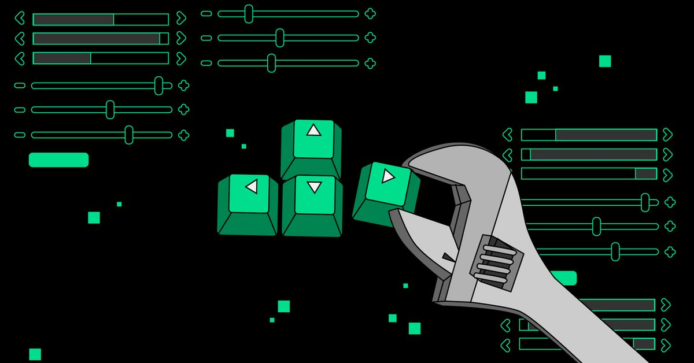
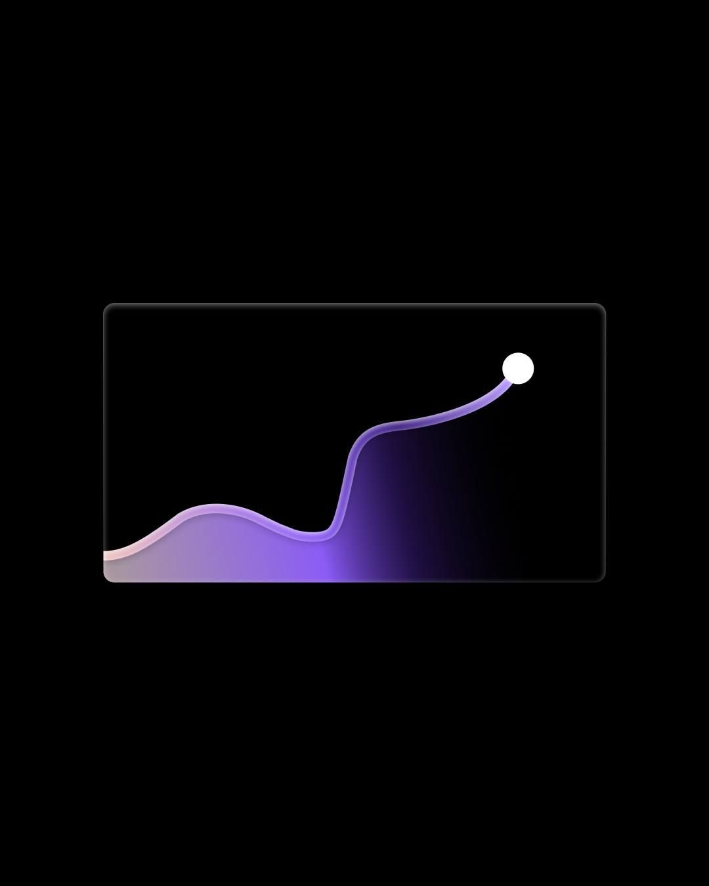

<!-- BANNER — upload as banner.jpg in your repo root -->
<div align="center">
  
</div>

<!-- TYPING + SOCIALS -->
<div align="center">

[](https://git.io/typing-svg)

<br/>

[](https://linkedin.com/in/kaushal-tiwari-668604363)
[](mailto:kaushalt102@gmail.com)
[](https://github.com/kaushalv17)


</div>

---

## 🧠 About Me



```text
🎓  CSE @ ABES Engineering College, Ghaziabad (2023–2027)
⚙️  Backend & systems engineer — I build from scratch
🔥  Redis-like cache: 53K ops/sec | sub-ms p99 over TCP
🌐  Distributed systems, WAL, consistent hashing, pub/sub
📦  Event-driven architecture · Kafka · Inngest pipelines
🌱  Open source contributor · GSoC 2025 aspirant
🏆  Oracle OCI 2025 Certified Generative AI Professional
💡  200+ LeetCode · Active CodeChef contestant
🤝  Ask me: Node.js · NestJS · Kafka · Redis · Docker
📫  kaushalt102@gmail.com
```

&nbsp;

&nbsp;

&nbsp;

<br clear="right"/>

---

## 🛠 Languages & Tools

<div align="center">


</div>

---

## ⚡ GitHub Stats

<div align="center">

[](https://git.io/streak-stats)

</div>

---

## 🚀 Featured Projects

### 🔴 Distributed Cache Engine
> Redis-like in-memory distributed cache built from scratch — zero external cache dependencies

- ⚡ **53,000+ ops/sec** | **sub-millisecond p99 latency** over raw TCP
- 🔄 Custom binary protocol + O(1) LRU eviction (4 configurable policies)
- 💾 Write-Ahead Logging crash recovery — full state restore in **< 1 second**
- 🌐 Consistent hash ring (150 virtual nodes) — only **~25% key remapping** on node addition
- 📡 Pub/Sub with glob pattern matching, heartbeat failure detection, WAL streaming
- ✅ **206 tests · 14 test files · 0 failures**

[](https://github.com/kaushalv17)

---

### 📈 Signalist — Event-Driven Stock Intelligence Platform
> Automated stock monitoring backend with AI-generated market summaries

- ⚙️ **720 automated Inngest workflow executions/day** (every 2 minutes)
- 🤖 **Gemini AI** daily stock summaries + scheduled email digests
- 🚀 **20 req/sec** under concurrent load via async pipelines
- 📡 Finnhub API — **~850ms avg latency** with ISR caching

[](https://github.com/kaushalv17)

---

## 🏆 Achievements

<div align="center">

☁️ **Oracle Cloud Infrastructure 2025 — Certified Generative AI Professional** &nbsp;|&nbsp; 💡 **200+ LeetCode problems**

🔥 **Distributed cache benchmarked against Redis** &nbsp;|&nbsp; 🏅 **Active — CodeChef & LeetCode contests**

</div>

---

## 💬 Dev Quote

<div align="center">

[](https://github.com/piyushsuthar/github-readme-quotes)

</div>

---

<!-- FOOTER BANNER -->
<div align="center">
  
</div>

<div align="center">
  <i>⚡ "I don't just use abstractions — I build them." ⚡</i>
</div>
