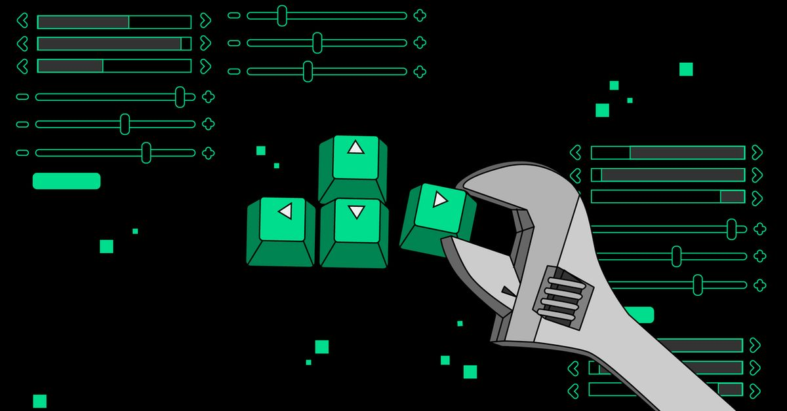

<!-- BANNER — upload as banner.jpg in your repo root -->

  

  
  
  

---

## 🧠 About Me

<pre>
🎓  CSE @ ABES Engineering College, Ghaziabad (2023–2027)
⚙️  Backend & distributed-systems engineer — I build the hard parts from scratch
🛡️  Shipped Quorvel: a live, paid reliability layer for AI agents (durable ledger + exactly-once)
🔴  Built a Redis-like distributed cache in Node.js: 53K ops/sec, sub-ms p99 over raw TCP
🌐  Depth in WAL, consistent hashing, pub/sub, idempotency, sagas, durable workflows
🤖  AI-native backends — OpenAI/LangChain, Gemini, embeddings, human-in-the-loop agents
🏆  Oracle OCI 2025 — Certified Generative AI Professional
💡  200+ DSA problems solved · active competitive programmer
📫  kaushalt102@gmail.com
</pre>

---

## 🛠 Languages & Tools

**Languages** 

**Backend & Systems** 

**AI / LLM** 

**Data & Messaging** 

**DevOps & Tools** 

---

## 🚀 Featured Projects

### 🛡️ Quorvel — Reliability Layer for AI Agents · [Live](https://quorvel.tech) · [App](https://app.quorvel.tech)
> Production SaaS + open TypeScript SDK that makes AI-agent actions **exactly-once, gated, and crash-safe**. Pattern: **record → gate → replay**.

- 📒 **Durable action ledger** — actions are recorded before they run, so retries are safe and crashes replay instead of double-firing
- 🔌 **~3-line integration** with drop-in adapters for **OpenAI, LangChain/LangGraph, MCP, and the Vercel AI SDK**
- ✋ **Human-in-the-loop approval gates** + policies (budgets, rate limits, conditional approval) + **saga auto-rollback**
- ☁️ Multi-tenant hosted Cloud API (Fastify) — Clerk auth, Neon Postgres, Redis/BullMQ, DLQ, circuit breakers, Paddle billing
- ✅ **155/155 Cloud-API tests + 200+ SDK tests green**

### 🔴 Distributed Cache Engine
> Redis-like in-memory distributed cache built from scratch in Node.js — zero external cache dependencies.

- ⚡ **53,000+ ops/sec** · **sub-millisecond p99** over a custom binary TCP protocol
- 🔄 O(1) LRU eviction (4 configurable policies) + partial-read framing
- 💾 **Write-Ahead Log** crash recovery — full state restore in **< 1 second**
- 🌐 Consistent hash ring (150 vnodes) — only **~25% key remap** on node add; heartbeat detection + primary→replica WAL streaming
- 📡 Pub/Sub with glob matching · **206 tests, 0 failures**

### 🟣 Reachly — AI-Native CRM & Agentic Campaign Engine
> Plain-English goal → validated audience → approved, queued send.

- 🧠 Gemini turns a goal into **Zod-validated rule JSON** compiled to **parameterized SQL** (the AI never writes raw SQL)
- 🔁 Idempotent event IDs + **7-state forward-only machine** → exactly-once, ordered updates under retries
- 🚚 BullMQ + Redis dispatch (10 workers, exponential backoff) · deployed as 2 services across Vercel + Render

### 📈 Signalist — Event-Driven Stock Intelligence
> Durable, event-driven backend for automated stock monitoring with AI summaries.

- ⚙️ **~720 durable Inngest executions/day** (alert eval every 2 min) — no separate worker infra
- 🤖 **Gemini** daily summaries + scheduled email digests; Finnhub (~850ms) with ISR caching · **20 req/sec**

---

## 🏆 Achievements

☁️ **Oracle OCI 2025 — Certified Generative AI Professional**  |  🛡️ **Launched a live, paid AI-agent reliability SaaS (Quorvel)**

🔴 **Hand-built distributed cache benchmarked against Redis**  |  💡 **200+ DSA problems · active competitive programmer**

---

## 📊 Contribution Graph

  

---

  
   
  <i>⚡ "I don't just use abstractions — I build them." ⚡</i>

